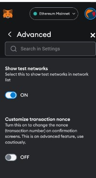

# NFT rank system for buying concert tickets

## SUU project

The aim of this project is to provide a learning platform for Web3 technologies. 

- frontend - simple react webpage for interacting with contracts
- backend - truffle project, running local node with NFT tickets and ranks smart contracts

Documentation is available [here](https://docs.google.com/document/d/1TLMwFXpCthf7yNgOx3ijIcUjzIAGXIpwliJWbig1XsA/edit).

## Prerequisites

- Docker
- Node.js

## Setting up

1. Clone this repository and navigate to root directory.
   ```
   git clone https://github.com/war-in/suu-nft-project
   ```

1. Build and run Docker containers in a compose file:
   ```
   docker compose up
   ```
   You can find individual containers' configuration inside `docker-compose.yml` file.
   This commands sets up a Docker environent with two containers:
   - `ganache` - container running a [Ganache](https://trufflesuite.com/docs/ganache/) instance. Ganache enables setting up a local Ethereum network.
   - `webapp` - container that builds and runs a React webapp. More about the webapp further is the document.

1. Analyze the [docker compose](./docker-compose.yml) file.
   Take a closer look at Ganache-CLI command options.
   ```yml
   command: >
      --mnemonic "..."
      --host 0.0.0.0
      --port 7545
      --gasLimit 20000000
   ```
   You can find more informations about these options [here](https://trufflesuite.com/docs/ganache/reference/cli-options/).
   
   > When running the Docker compose instance on Windows with WSL, the automatic refresh of the web application on file save may not work properly.
   > To mitigate the issue `WATCHPACK_POLLING=true` environment variable is used, but the refresh may not be instantaneous.

1. In a separate terminal, navigate to the `<root>/backend` directory and run a [Truffle](https://trufflesuite.com/docs/truffle/) node.
   ```
   npx truffle console
   ```
   This command will run a Truffle instance in console mode.
   When in Truffle console, run `migrate` command to build and deploy smart contracts to Ganache node.
   Whenever You make any changes to smart contracts, run a migration.
   The output of the command should look simillar to:
   ```
   truffle(development)> migrate

   Compiling your contracts...
   [...]
   > Total deployments:    3
   > Final cost:           0.13875156 ETH
   ```
   You can find more about Truffle commands [here](https://trufflesuite.com/docs/truffle/reference/command-line-options/).
   For example, run `test` command to run project's tests.


## Frontend setup

1. Install MetaMask as a chrome browser extenstion.  
Go to chrome extensions -> search for MetaMask and press install. Pin the metamask extension to the top bar.


1. Create an account: 
- open MetaMask
- press create an account
- provide password
- secure my wallet
- **remember to save your passphrase in case of password restoring**. 


Next, log in to your account. You should see the screen with one account and 0 ETH balance on the Ethereum Mainnet.


1. Adding a localhost test network:
- click a profile icon in the top right corner and go to settings
- in the search bar type: “Show test networks” and open this setting (it should be also reachable from the Advanced tab after opening settings).
- toggle on this setting to show test networks. 
- verify on the main screen that networks like Goerli or Sepolia have appeared.



- go back to the main screen
- click the rounded corner button with network name Ethereum Mainnet next to the profile icon. 
- click the Add network button. The new chrome tab should open immediately, open it and go to Networks settings. Click add a network button, fill the form with the same data as presented below, then save the network. Go back to the app screen, open MetaMask and switch the network to **localhost7545**.


1. Importing test wallet to MetaMask:

- if ```docker compose up``` command worked properly, you would see the same list of test accounts as shown on the screenshot below.
Verify that your addresses are exactly the same as provided above. If it differs, check whether the docker configuration has the same mnemonic as presented on the screenshot. If not, change mnemonic to this one: ```lighten crowd lavish spectacular bustling saw tasteless nauseatic panoramic mixed absorbing past```


- open your MetaMask wallet -> profile icon -> Import account -> Select Type -> Private key. 
- paste in the textinput private key from the index 0 (with prefix 0x90ec..) - this will import your admin account from which you will be able to create ranks and events. 
- it is recommended to import any other account (from a private keys list, anyone could be selected). This account will simulate a user's account, who will only have an access to events tab, for ranks and tickets purchases.


1. Debugger (optional)

- open new terminal from the root directory -> ```cd backend && npm install abi-decoder```
- restart truffle console
- ```const abiDecoder = require('abi-decoder');```  - this command is importing params decoder to the environment
- ```const abi = require(**path_to_your_contract_build** e. g. './build/contracts/ManageRanks.json').abi``` - reading contract’s interface
- ```abiDecoder.addABI(abi)```  - adding an ABI to the decoder instance
- ```let tx = await web3.eth.getTransaction(th_hash in single quotes);```  - import a transaction that reverted, the hash is displayed in the ganache-cli
- ```tx```  - show transaction params
- ```abiDecoder.decodeMethod(tx.input);```  - show transaction data which was sent from the frontend app

## Contracts

1. Rank

   The Rank contract represents a rank/tier/level of a user. It uses [lazy minting](https://www.alchemy.com/overviews/lazy-minting#:~:text=creates%20the%20NFT.-,What%20is%20lazy%20minting%3F,-Lazy%20minting%20lets) concept. To check Rank's fields and methods go to `backend/contracts/ranks/Rank.sol` file.

1. Ranks

   The Ranks contract is responsible for managing Rank contracts. It keeps addresses of few Rank contracts and allows users buying them.
   To buy `Rank3`, user has to have `Rank2` and sufficient money amount. User also needs to approve Ranks contract to burn his old rank (unless he doesn't have any).
   One user has one Rank at a time. There can be more than one `Ranks` contract.
   To read more about Ranks contract go to `backend/contracts/ranks/Ranks.sol` file.

1. Ticket

   The Ticket contract sells tickets for events. Every `Ticket` has Ranks contract assigned, to be able to give special privileges for users with higher ranks.
   To read more about Ticket contract go to `backend/contracts/Ticket.sol` file.

1. Admin

   The Admin functionality is split between two different contracts.

   1. ManageRanks
   
      The ManageRanks contract keeps all deployed Ranks contracts. It is necessary because there can be more than one group of Rank (more than one Ranks contract).
      It has addresses of all Ranks contracts and lets Admin create those Ranks.
      Code of this contract is available here: `backend/contracts/admin/ManageRanks.sol`

   1. ManageTickets
   
      The ManageTickets contract keeps all deployed Tickets contracts. It is necessary because there can be a lot of events with tickets.
      It has addresses of all Ticket contracts and lets Admin create those Tickets.
      Code of this contract is available here: `backend/contracts/admin/ManageTickets.sol`

## Exercises!

Search for comments with TODO's and have fun :fire:

1. Rank.sol

   - fill `constructor` implementation
   - fill `mintTo` implementation

2. Ranks.sol

   - fill `constructor` implementation
   - fill `buy` implementation

3. Ticket.sol

   - fill `buy` implementation

4. ManageTickets.sol

   - emit an event

## Troubleshooting

- **my transaction has been reverted** - analyze revert reason from the contract’s code if it is implemented, if not go to 8.5 Debugging section and try to analyze your code
- **I run out of eth** - just restart docker or ganache node
- **all my transactions are stucked and are in the state Processing, Pending or Queued** - that’s a common issue from the MetaMask local testnets themselves, the quick fix is to import another account via private key from the available in the node, optionally: you could wait ~5-10 minutes until the transaction will be finalized (not recommended)
- **I cannot change my account to the another one** - open MetaMask -> click the button which is on the left side from the account address -> disconnect current account OR switch to the wanted one
- **my transaction fails due to the incorrect nonce (could be detected both in MetaMask and chrome Inspect)** -  Settings -> Advanced -> Clear activity and nonce data -> Clear activity tab data


